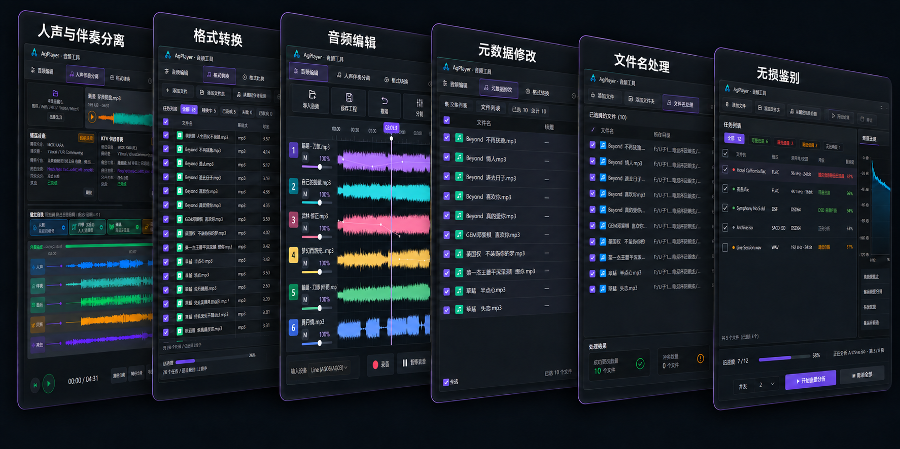

  

# AgPlayer

**听见音乐，看见声音。**

AgPlayer 是一款以轻量、简洁为设计方向的本地音频播放器，通过波形展示声音细节，将音乐播放、曲库管理和常用音频工具放在一起。

[访问官网](https://agplayer.com) · [版本发布](https://github.com/gddjag/AgPlayer/releases)

## 主要特点

- **四种波形显示模式**：纯色波形、频彩波形、RGB 渐变与动态频谱，从振幅和频段等不同角度观察音乐。
- **多种界面布局**：经典双窗口、专业模式、单窗口和迷你播放器，适应曲库整理、细节查看与日常聆听。
- **本地音乐管理**：用歌单、标签、收藏与评分整理曲库，按歌曲、艺人、标签、评分和 BPM 搜索筛选。
- **常用音频工具**：伴奏分离、格式转换、音频编辑、元数据修改、文件名处理和无损鉴别。

## 界面预览

### 经典双窗口

简洁轻便，播放器与音乐列表可自由拆分、磁吸组合，兼顾播放控制和曲库浏览。

### 专业模式

支持加速播放、BPM 调整与节拍网格，结合大幅滚动波形查看声音细节、把握节奏。

### 单窗口

音乐库与整曲波形集中在一个窗口中。一键框选波形，即可将片段拖到桌面或剪辑软件时间线，让选段与剪辑更直接。

## 六大音频工具

从声音处理到文件整理，常用工具集中在一个窗口中。

| 工具 | 主要用途 |
| --- | --- |
| 人声与伴奏分离 | 分离人声与伴奏，并按所选模型提取鼓组、贝斯等音轨，方便试听与导出。 |
| 格式转换 | 批量转换常见音频格式，调整采样率、声道等参数，并可保留封面和元数据。 |
| 音频编辑 | 在波形中选段、分割、裁剪，添加淡入淡出，调整播放速度与音调并导出音频。 |
| 元数据修改 | 批量整理标题、艺术家、专辑、标签和封面，让音乐信息更完整。 |
| 文件名处理 | 批量添加或移除前后缀、调整序号，先预览结果，再统一重命名。 |
| 无损鉴别 | 结合频谱与音频特征分析疑似有损转码、升频等情况，为音源质量提供判断参考。 |
