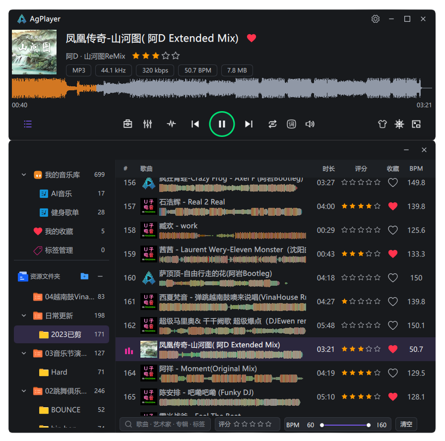
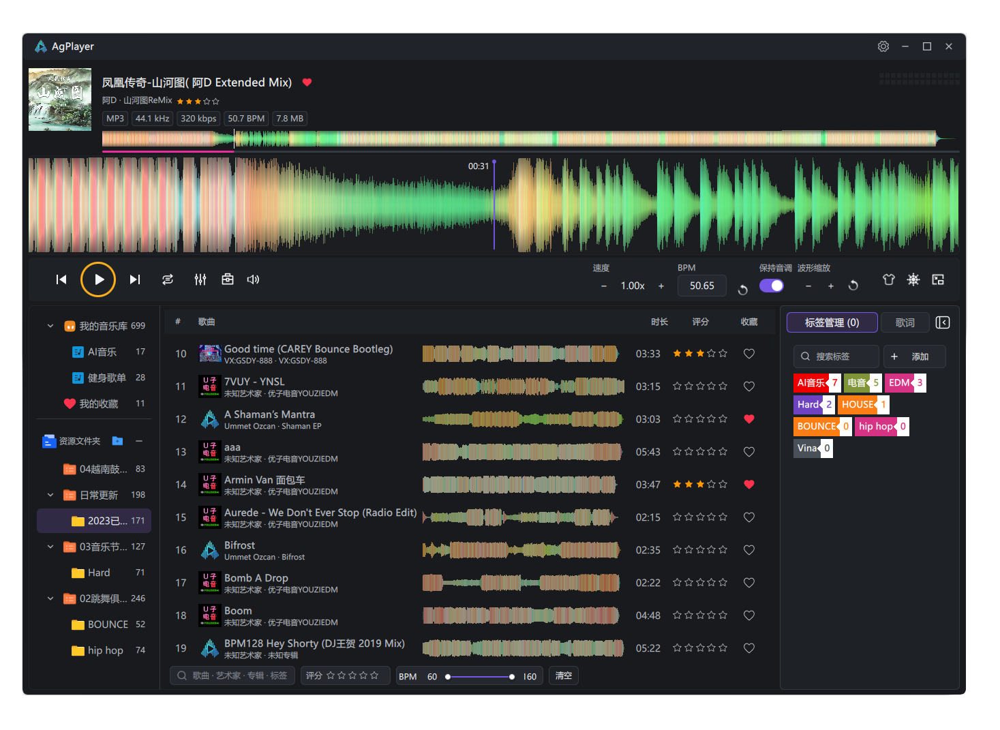
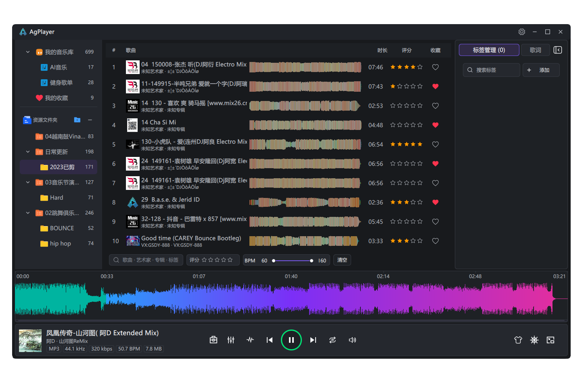
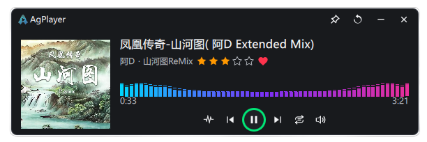

# AgPlayer

**听见音乐，看见声音。**

AgPlayer 是一款以轻量、简洁为设计方向的本地音频播放器，通过波形展示声音细节，将音乐播放、曲库管理和常用音频工具放在一起。

[访问官网](https://agplayer.pages.dev) · [版本发布](https://github.com/gddjag/AgPlayer/releases)

官网已上线，独立域名 `agplayer.com` 正在接入中。

首个正式版本 **v1.0.0** 正在准备中，Windows 安装包尚未开放下载。后续正式安装包将按版本号发布到 GitHub Releases，并提供 R2 下载地址。

## 主要特点

- **四种波形显示模式**：纯色波形、频彩波形、RGB 渐变与动态频谱，从振幅和频段等不同角度观察音乐。
- **多种界面布局**：经典双窗口、滚动播放、单窗口和迷你播放器，适应曲库整理、细节查看与日常聆听。
- **本地音乐管理**：用歌单、标签、收藏与评分整理曲库，按歌曲、艺人、标签、评分和 BPM 搜索筛选。
- **常用音频工具**：伴奏分离、格式转换、音频编辑、元数据修改、文件名处理和无损鉴别。

## 界面预览

### 经典双窗口

简洁轻便，播放器与音乐列表可自由拆分、磁吸组合，兼顾播放控制和曲库浏览。

### 滚动播放

支持加速播放、BPM 调整与节拍网格，结合大幅滚动波形查看声音细节、把握节奏。

### 单窗口

音乐库与整曲波形集中在一个窗口中。一键框选波形，即可将片段拖到桌面或剪辑软件时间线，让选段与剪辑更直接。

### 迷你播放器

小窗口也能完整聆听：保留封面、歌曲信息、可视化和常用播放控制，少占空间，专注音乐。

## Cloudflare Pages 自动部署配置

此仓库包含官网静态页面和发布说明。网站使用 HTML、CSS 和原生 JavaScript；构建脚本仅依赖 Node.js 标准库。

源文件为 `index.html`、`download.html`、`about.html` 和 `assets/`。构建只将这些文件复制到 `public/`，Cloudflare 仅发布该目录。

Cloudflare Pages 项目 `agplayer` 已连接 GitHub 仓库 `gddjag/AgPlayer` 的 `main` 分支，并已完成首次部署。项目根目录为仓库根目录：

- 构建命令：`node scripts/build-site.mjs`
- 构建输出目录：`public`

提交到 GitHub `main` 的网页更新会自动触发 Cloudflare 构建和部署，具体结果可在 Pages 项目中查看。

仓库原有 `CNAME` 保留；独立域名 `agplayer.com` 仍在接入中，当前通过上述 Pages 地址访问官网。
