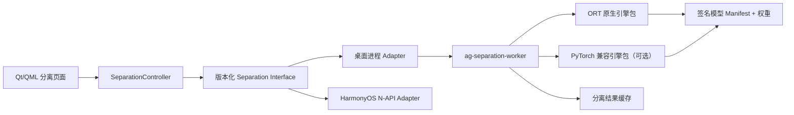

# AgPlayer 人声/伴奏分离插件可行性分析报告

- 日期：2026-08-09
- 范围：只研究模型兼容、推理运行时、跨平台复用和许可证风险；不包含功能代码
- 证据标准：官方文档、官方仓库、官方源代码和项目方产品页

## 重复工作流候选清单

| 工作流 | 证据与时间 | 频次/置信度 | 推荐形式 | 是否值得封装 |
|---|---|---|---|---|
| 分离能力的检测、下载、校验、运行、缓存、恢复 | 2026-07-19 已做过可移动运行时与真实 CLI 分离；2026-08-09 再次提出正式插件化 | 已出现 2 次/高 | **扩展现有音频工具 + 新增独立深模块** | 值得；状态稳定、可测试、复用成本高 |
| 真实音频分离回归矩阵 | 2026-07-19 已验证短样本，但应用内触发/切换/播放仍需闭环；本报告再次要求跨模型跨平台验收 | 已出现 2 次/高 | **扩展现有测试与发布闸门** | 值得；能阻止“CLI 成功即宣称功能完成” |
| 定时监控 UVR 模型更新 | 目前只有未来可能更新的推断，没有既有周期与责任人 | 证据不足/低 | **跳过自动化** | 暂不值得；先冻结首发兼容目录 |

本次只交付分析报告，不创建 Skill、自定义子代理或自动化；实现阶段优先扩展现有音频工具与测试体系。

## 产品介绍（建议文案）

> **人声/伴奏分离是 AgPlayer 的按需扩展能力。** 播放器本体不携带 AI 引擎和模型；第一次使用时，只下载当前平台所需的分离 Worker，模型由用户按需选择。分离在独立进程中离线执行，崩溃不拖垮播放器；结果可在原曲、人声、伴奏之间同步切换并导出。

首发宣传应写“支持已验证的 MDX 模型；Demucs `htdemucs_ft` 与更多 UVR 模型分阶段加入”，不能先写“UVR5 全模型百分之百兼容”。

## 结论摘要

1. **“UVR5 全部模型”不是一种统一格式。** UVR 5 的三个主家族至少包含 MDX-Net 的 `.onnx`/`.ckpt`、VR 的 `.pth` 加参数 JSON、Demucs 的 `.th` 加 YAML 模型包；加载器还依赖模型哈希映射、架构代码、STFT/重叠拼接和后处理。仅嵌入 ONNX Runtime，不能原样加载全部 UVR 模型。
2. **Trama 没有独立的“Trama 核心模型”。** 可识别的 Trama 官方产品使用 Meta 的 `htdemucs_ft`；该模型名实际表示 4 个细调模型组成的 ensemble。Trama 官方发行包捆绑 Python、PyTorch、FFmpeg 和权重，Windows 约 3.1 GB、Linux 约 3.9 GB、macOS 约 500 MB。这直接说明“原格式完整兼容”和“很小的纯原生 Worker”存在结构性冲突。
3. **最可行的长期主线是原生 C++ 音频核心 + ONNX Runtime Worker，但必须建立“已验证模型目录”，不能承诺任意 UVR 文件即放即用。** 原生 MDX ONNX 可以先落地；VR、Demucs/`htdemucs_ft` 必须逐模型转换并做数值、听感和性能验证，或由一个更大的 PyTorch/LibTorch 兼容包承担。
4. **桌面 Worker 外置可保证播放器主体不受 AI 依赖和崩溃拖累。** 但 Worker 仍需按 OS/CPU 架构分别构建，不存在一个二进制覆盖 Windows、macOS、Linux、Android、iOS、HarmonyOS。
5. **C++ 核心复用到 HarmonyOS 在接口层可行，推理运行时尚未被官方支持矩阵确认。** OpenHarmony NDK 明确支持 C/C++ 和 Node-API 桥接 ArkTS；ONNX Runtime 官方支持表覆盖桌面、Android、iOS，但未列 HarmonyOS/OpenHarmony。因此 HarmonyOS 只能在真机完成源码交叉编译、算子、内存和性能 POC 后再承诺。
6. **许可证必须按“每个权重文件”治理。** UVR/Demucs 代码许可证不能自动证明下载中心内每个第三方权重都可商用、镜像分发或二次转换。

## 证据分级

- **已确认事实**：来源直接陈述，或可由官方源代码直接读出。
- **工程推断**：从已确认事实推导出的实现结论，仍需 POC 或基准验证。
- **待验证事项**：当前一手来源不足，不能写进产品承诺。

## 1. UVR5 的真实模型加载方式

### 1.1 模型并非统一 ONNX

**已确认事实**

UVR 源码把模型分为独立目录：`models/VR_Models`、`models/MDX_Net_Models`、`models/Demucs_Models`，Demucs v3/v4 另有 `v3_v4_repo`；同时维护 VR/MDX 的模型数据 JSON、哈希目录和 Demucs 名称映射。[UVR.py 模型目录与元数据](https://github.com/Anjok07/ultimatevocalremovergui/blob/master/UVR.py#L211-L230)

UVR 的公共模型下载地址、模型数据地址和扩展名常量直接列出 `.onnx`、`.ckpt`、`.pth`、`.th`、`.yaml`、`.json`。其公开下载中心还依赖独立的模型仓库和配置仓库，而非单一格式文件列表。[constants.py 下载源与扩展名](https://github.com/Anjok07/ultimatevocalremovergui/blob/master/gui_data/constants.py#L88-L119)

| 家族 | 原始文件/伴随数据 | UVR 的真实加载路径 | 运行时依赖 |
|---|---|---|---|
| MDX-Net | 常见 `.onnx`；也支持 `.ckpt`；较新的 MDX-C 还使用配置 YAML | 普通 ONNX 在满足分段条件时创建 `onnxruntime.InferenceSession`；其他路径会用 `onnx2pytorch.ConvertModel`；`.ckpt` 由 PyTorch/Lightning 路径加载 | ONNX Runtime **或** PyTorch、ONNX、onnx2pytorch；另有 STFT、分段、补偿和输出反演逻辑 |
| VR Architecture | `.pth` 权重 + 哈希映射出的模型参数 JSON | 根据模型大小/元数据构造特定 `CascadedNet`，然后 `torch.load` 权重；参数 JSON决定采样率、频带和网络配置 | PyTorch + UVR 自有 VR 网络与频谱处理代码 |
| Demucs v1-v4 | `.gz`/`.ckpt`/`.th`；v3/v4 支持 YAML bag | v3/v4 经 Demucs 本地仓库加载模型或 YAML bag，再调用 `apply_model` | PyTorch、Demucs 架构、分段/重叠、音频读写等 |

以上加载路径可直接在 UVR 推理源代码中确认：

- MDX `.ckpt`、ONNX Runtime 与 ONNX→PyTorch 分支：[separate.py MDX 加载](https://github.com/Anjok07/ultimatevocalremovergui/blob/master/separate.py#L466-L493)
- VR 根据参数和网络容量加载 `.pth`：[separate.py VR 加载](https://github.com/Anjok07/ultimatevocalremovergui/blob/master/separate.py#L1008-L1039)
- Demucs v1-v4 加载及本地 repo 路径：[separate.py Demucs 加载](https://github.com/Anjok07/ultimatevocalremovergui/blob/master/separate.py#L786-L826)
- UVR 的完整 Python 依赖同时包含 `torch`、`onnx`、`onnxruntime`、`onnxruntime-gpu`、`onnx2pytorch`、librosa、SciPy 等：[requirements.txt](https://github.com/Anjok07/ultimatevocalremovergui/blob/master/requirements.txt)

UVR 也不能仅凭一个未知文件自动确定所有参数：它计算模型哈希并查表；无法识别时会要求用户补充模型参数。[UVR.py 哈希和未知模型处理](https://github.com/Anjok07/ultimatevocalremovergui/blob/master/UVR.py#L673-L729)

**工程推断**

- “支持 UVR5 全部模型”应定义成**一份带版本的兼容目录**，每个模型记录 `architecture`、权重格式、输入输出、STFT/采样率/分段参数、stem 映射、SHA-256、许可证和已验证引擎版本，而不是扫描扩展名后盲目加载。
- “用户自行放模型到 `models`”可以支持，但只有同时存在可信 sidecar manifest，或哈希命中官方兼容目录时才显示为“可运行”；其余文件应显示为“未识别”，不能假装支持。
- UVR 的当前模型目录会继续变化。“全部”必须绑定到明确快照，例如“兼容 UVR 5.6 公共目录截至某日”，否则无法形成可测试的终止条件。

### 1.2 “模型外置”不等于“运行时很小”

**已确认事实**

UVR 的发布说明称安装包包含 Python、PyTorch 和其他依赖，无需用户另装环境。[UVR v5.6 发布页](https://github.com/Anjok07/ultimatevocalremovergui/releases/tag/v5.6)

**工程推断**

- 将模型权重移出安装包，只能消除权重体积；若要求直接运行 `.pth`、`.ckpt`、`.th`，Worker 仍要携带与这些格式和架构匹配的运行时及实现。
- 主播放器体积可保持不变，但“分离工具插件 xx MB”必须按实际 Worker 方案和每个平台产物测量，不能预先给出虚假固定数字。

## 2. `htdemucs_ft`、Demucs 与 Trama

### 2.1 `htdemucs_ft` 的真实格式与依赖

**已确认事实**

Demucs 官方模型表说明 `htdemucs_ft` 是 `htdemucs` 的细调版本，运行约慢 4 倍，输出 drums、bass、other、vocals 四轨。[Demucs README](https://github.com/facebookresearch/demucs#separating-tracks)

`htdemucs_ft.yaml` 不是神经网络权重，而是一个 bag：它引用 `f7e0c4bc`、`d12395a8`、`92cfc3b6`、`04573f0d` 四个模型，并对四个来源分别赋权。[官方 htdemucs_ft.yaml](https://github.com/facebookresearch/demucs/blob/main/demucs/remote/htdemucs_ft.yaml)

四个签名对应的实际权重位于官方文件表中，扩展名为 `.th`。[官方 remote/files.txt](https://github.com/facebookresearch/demucs/blob/main/demucs/remote/files.txt#L22-L29)

Demucs 本地仓库会扫描 `.th`，校验文件名中的哈希，并读取 YAML bag 后逐个加载模型；模型包通过 `torch.load` 读取 `klass`、构造参数和 `state`。[repo.py](https://github.com/facebookresearch/demucs/blob/main/demucs/repo.py#L70-L131) [states.py](https://github.com/facebookresearch/demucs/blob/main/demucs/states.py#L46-L75)

HTDemucs 官方实现本身是 PyTorch `nn.Module`，包含波形与频谱双分支、STFT/iSTFT、卷积和跨域 Transformer；默认采样率 44.1 kHz、训练分段 10 秒。[htdemucs.py](https://github.com/facebookresearch/demucs/blob/main/demucs/htdemucs.py#L24-L140)

Demucs 分离的最小依赖明确要求 PyTorch、torchaudio、einops、julius、openunmix 等。[requirements_minimal.txt](https://github.com/facebookresearch/demucs/blob/main/requirements_minimal.txt)

**工程推断**

- 原始 `htdemucs_ft` 不是一个可直接交给 ONNX Runtime 的模型；它是 4 个 PyTorch 模型加一个 YAML 编排文件。
- 将它纳入轻量原生 Worker，必须选择：携带 PyTorch/LibTorch 兼容栈；或把四个模型逐一导出为部署格式，并在 C++ 中重现分段、重叠拼接、归一化、STFT/iSTFT、shifts 与 bag 聚合。
- 导出成功不等于等价。必须按每个 stem 做数值误差、整曲边界、峰值/削波、听感和性能回归。

### 2.2 “Trama 核心模型”命名应纠正

**已确认事实**

可识别的一手来源是 Ohlhorst Digital 的 Trama 产品页。它明确称 Trama 使用 Meta `htdemucs_ft`，约 320 MB、由 4 个模型组成，并捆绑 Demucs、PyTorch、FFmpeg。官方页面列出的包约为 Windows 3.1 GB、macOS 500 MB、Linux 3.9 GB。[Trama 官方页](https://www.ohlhorstdigital.com/trama/)

**工程推断**

- 产品 UI 中应写“Trama 同款：Demucs `htdemucs_ft`”或“`htdemucs_ft` 高质量四轨”，不应把“Trama”注册成新的模型架构或权重来源。
- Trama 是可识别的产品，但其页面没有提供一个独立的“Trama 模型仓库”；权威权重来源仍是 Meta Demucs 文件表。
- Trama 的官方包体积是现实参考：直接复刻完整 Python/PyTorch 工作栈不符合“极致轻量原生 Worker”，虽然仍可通过外置包保护 AgPlayer 主程序体积。

## 3. ONNX Runtime 的官方跨平台边界

### 3.1 已确认支持

**已确认事实**

ONNX Runtime C API 官方产物覆盖 Windows、Linux、macOS；C API 可加载磁盘或内存模型、设置线程池、图优化并注册不同 Execution Provider。[C API 文档](https://onnxruntime.ai/docs/get-started/with-c.html)

官方移动端文档列明：Android 可用 Java/C/C++ `onnxruntime-android`，iOS 可用 C/C++ `onnxruntime-c`；所有目标默认有 CPU，Android 可用 NNAPI/XNNPACK，iOS 可用 CoreML/XNNPACK。[移动端部署文档](https://onnxruntime.ai/docs/tutorials/mobile/)

官方构建文档还列出 Windows/Linux 的 XNNPACK 构建，以及 Android/iOS 的最小化构建方式；Execution Provider 可按需作为共享库部署。[Execution Provider 构建文档](https://onnxruntime.ai/docs/build/eps.html)

移动端可按模型所需算子裁剪 runtime。官方 ResNet50 示例中，AAR 从约 24.4 MB 降到约 7.5 MB，`arm64-v8a` 的未压缩 so 从约 16.3 MB 降到约 4.0 MB；这只是该示例，不代表音频分离模型也能达到相同尺寸。[ORT Mobile 减小二进制](https://onnxruntime.ai/docs/tutorials/mobile/#reduce-application-binary-size)

**工程推断**

- ONNX Runtime 是 AgPlayer 跨桌面、Android、iOS 的最佳共同推理 API 候选，且 C API 适合封装在不暴露 Qt 类型的 C ABI 后面。
- 不同平台仍要交付独立 runtime：Windows 可先 CPU，再评估 DirectML；Linux 可先 CPU/XNNPACK，再按硬件提供 CUDA；macOS/iOS 评估 CoreML/XNNPACK；Android 评估 XNNPACK/NNAPI。
- Execution Provider 的“可用”不代表该模型会全部下沉到加速器。官方移动文档明确指出，算子不支持造成图分区时，性能可能反而下降；必须逐模型、逐设备测量。

### 3.2 未确认支持

**待验证事项**

- ONNX Runtime 官方安装、移动端和构建文档没有把 HarmonyOS/OpenHarmony 列为正式目标。不能由“Android 是 ARM64”推导出 HarmonyOS 受支持。
- HTDemucs/VR 的官方原始权重不是 ONNX；目前引用的一手来源中没有 Meta/UVR 提供的官方 `htdemucs_ft` ONNX 发布物。
- MDX ONNX 的“文件可加载”还不等于与 UVR 输出一致；UVR 的前后处理和模型哈希参数必须纳入兼容层。

## 4. HarmonyOS：C++ 复用可行，推理仍需 POC

**已确认事实**

OpenHarmony NDK 是 C/C++ 工具链，支持复用既有 C/C++ 库，并通过 Node-API 连接 ArkTS/JS；文档同时提醒 OpenHarmony Node-API 并非与 Node.js 完全兼容，默认构建系统为 CMake。[OpenHarmony NDK 概览](https://gitee.com/openharmony/docs/blob/master/en/application-dev/napi/ndk-development-overview.md)

OpenHarmony 使用 LLVM 的 libc++ 作为 C++ 运行库。[HarmonyOS libc++ 文档](https://developer.huawei.com/consumer/en/doc/harmonyos-references/cpp)

Qt 官方支持平台表覆盖 Windows、macOS、Linux、Android、iOS 等，但未列 HarmonyOS；Qt 明确说明未列配置不属于官方支持。[Qt 6 支持平台](https://doc.qt.io/qt-6/supported-platforms.html)

**工程推断**

- 用户提出的边界是正确方向：波形、解码协调、模型清单和推理调度放入无 Qt 类型的 C++17 核心；对外提供版本化 C ABI；HarmonyOS 用单独 N-API 薄封装，ArkUI 重做界面。
- 不应让 QML/Qt、`QString`、`QObject`、平台路径或桌面子进程细节进入核心 ABI。
- HarmonyOS 端不能在报告阶段承诺 ONNX Runtime。应先做 arm64 真机 POC：交叉编译 CPU 最小 runtime、加载一个目标 ONNX、运行 STFT/推理/iSTFT、验证线程/内存/温升/后台限制，再决定是否采用 ORT 或平台专用推理框架。

**待验证事项**

- ONNX Runtime 在目标 HarmonyOS SDK/API 版本上的可编译性、libc++/系统调用兼容性。
- 目标模型的算子覆盖和内存峰值；HarmonyOS NPU/GPU 是否存在可用且可发布的执行后端。
- N-API 大数组跨语言复制成本、异步任务取消和应用后台执行约束。

## 5. 三种原生方案比较

下表中的大小与性能为**工程相对判断**，不是未经实测的产品指标。

| 方案 | 原始 UVR 权重兼容性 | Worker 体积 | 跨平台 | 性能潜力 | 主要问题 | 结论 |
|---|---|---:|---|---|---|---|
| LibTorch/C++ | 对 PyTorch 算子和 state dict 亲和；但 UVR/Demucs 的 Python 序列化对象、架构代码和前后处理仍需适配，不能假定直接加载全部文件 | 大 | 桌面较成熟；移动端主线已转向 ExecuTorch；HarmonyOS 未确认 | CPU/GPU 高，但后端包大且平台差异大 | 依赖重、ABI/版本耦合、移动端路线分裂 | 仅适合作为可选“大兼容包”或迁移工具，不宜做默认轻量 Worker |
| ONNX Runtime/C++ | MDX `.onnx` 最直接；VR、Demucs 必须转换并验证 | 中到小；可按算子裁剪 | 官方覆盖 Win/macOS/Linux/Android/iOS；HarmonyOS 未确认 | 高，且可按平台选 EP | 导出和算子兼容、复杂 STFT/Transformer、数值一致性 | **推荐长期主线** |
| 完全原生 C++ 重写推理 | 可读取权重需自行定义转换；不能自然兼容 Python checkpoint | 理论最小 | 取决于自研后端 | 理论最高、控制最强 | 要重写张量算子、卷积、注意力、STFT、调度和硬件优化，验证成本极高 | 只重写稳定的音频前后处理；不建议首版重写整个神经网络运行时 |

LibTorch 是 PyTorch 官方 C++ 分发，提供头文件、库和 CMake 配置；Windows 还需把相关 DLL 一并部署。[LibTorch 安装文档](https://docs.pytorch.org/cppdocs/installing.html) PyTorch 的移动端主线已转向面向设备的 ExecuTorch，而不是把完整 LibTorch 原样带到手机。[ExecuTorch 官方介绍](https://pytorch.org/projects/executorch/)

**推荐组合**

1. `ag-separation-ort`：默认轻量 Worker；原生 C++17 + ONNX Runtime + 原生音频前后处理；首发只启用已验证 MDX ONNX。
2. `ag-separation-compat`：如果商业需求确实要求原始 VR/Demucs 文件高覆盖，可作为另行下载的大兼容包；不得把它称为轻量。
3. 转换工具只在构建/模型发布流水线运行，不进入用户机器；产出经过验证的 ONNX/ORT 权重和 manifest。
4. UI 展示“已验证”“实验性”“未识别”三种状态；不以文件后缀冒充兼容。

## 6. 建议的模型契约

每个可下载模型应有签名 manifest，至少包含：

```text
model_id / display_name / family / engine_min_version
weight_files[] / sha256[] / total_bytes
input_sample_rate / channels / segment / overlap / shifts
stft_nfft / hop / dimensions / normalization
output_stems[] / output_mapping / compensation
source_url / publisher / model_license / license_url
conversion_recipe_version / validation_report / known_devices
```

**工程推断**

- 模型仓库只发布 manifest 和来源链接；Worker 下载后逐文件 SHA-256 校验，再原子移动到 `models/<model_id>/<version>/`。
- “一键下载 UVR5 模型”应引用经许可的上游地址，不应默认镜像所有权重。
- 用户手动放入模型时，先离线识别哈希；未命中则要求配套 manifest。绝不自动执行模型文件中可能携带的 Python pickle 对象。
- Worker 协议和模型 manifest 都要独立版本化。这样升级推理引擎通常只换 Worker；若模型格式或前处理契约变化，则更新 manifest，而无需更新播放器 UI。

### 模型文件安全边界

**已确认事实**

UVR 的 `.pth`、`.ckpt`、`.th` 路径最终会调用 `torch.load`。PyTorch 官方文档明确警告：该加载器底层使用 unpickler，绝不能加载不可信来源的数据。[torch.load 安全警告](https://docs.pytorch.org/docs/stable/generated/torch.load.html)

**工程推断**

- 独立 Worker 能隔离崩溃，但它不是恶意模型沙箱；若 Worker 拥有用户文件和网络权限，恶意序列化内容仍可能造成损害。
- 官方一键下载只允许签名 manifest、固定来源和 SHA-256。手动导入默认只开放无可执行反序列化语义的已验证 ONNX；PyTorch 格式必须明确提示风险，并在更严格的权限隔离中处理。

## 7. 权重许可证与分发风险

**已确认事实**

UVR README 明确说明其代码为 MIT，并要求第三方应用使用“我们的模型”时给予 UVR 及开发者署名；README 同时列出多个不同模型/架构作者。[UVR README 许可证与致谢](https://github.com/Anjok07/ultimatevocalremovergui#credits)

Demucs 仓库代码许可证为 MIT。[Demucs LICENSE](https://github.com/facebookresearch/demucs/blob/main/LICENSE) 但官方仓库中存在专门询问预训练权重许可证、尚未获得明确结论的开放问题，这说明不能只凭代码 LICENSE 推断所有权重条款。[Demucs issue #327](https://github.com/facebookresearch/demucs/issues/327)

Demucs 官方说明 `htdemucs`/`htdemucs_ft` 使用 MUSDB HQ 加额外 800 首歌曲训练，但未在模型文件表中给出这批额外数据的逐项权利说明。[Demucs README](https://github.com/facebookresearch/demucs#hybrid-transformer-demucs)

**工程推断**

- 上线前必须逐模型确认：权重的使用权、商业使用、再分发、镜像、格式转换、署名、许可证文本展示和地域限制。
- “用户自行下载”能减少由 AgPlayer 直接分发权重的风险，但不会自动消除引导下载、商业使用或转换模型的合规责任。
- 模型 manifest 必须把“代码许可证”和“权重许可证”分开；缺少明确权重许可证时，默认不进入官方一键下载目录。
- 涉及商业发布时应由法律专业人士审查；本报告不是法律意见。

## 8. 可执行的验证门槛

在承诺“原生支持 UVR5/Trama 所用全部模型”前，至少完成以下闸门：

1. 冻结目标模型清单和上游快照，列出每个文件、参数、哈希和许可证。
2. 用原版 UVR/Demucs 生成基准输出；定义逐 stem 数值容差、整曲听感样本和性能基线。
3. 对每个模型验证下载、断点续传、哈希失败、磁盘不足、取消、Worker 崩溃和恢复。
4. Windows 10/11 x64 首先完成 CPU 基线，再测 DirectML/CUDA 可选包；不得用“能创建 session”代替完整歌曲验证。
5. macOS、Linux 分别构建并测真实硬件；Android/iOS 在桌面稳定后单独立项。
6. HarmonyOS 在 arm64 真机完成 ORT 或替代运行时 POC 后，才把它列为支持平台。

## 9. 推荐架构：主程序、Worker、引擎、模型四层分离



### 9.1 Module 与 Interface

1. **播放器集成 Module**：只负责 UI 状态、下载调度、任务控制、播放结果注册；不得链接 ORT、PyTorch、CUDA 或模型解析代码。
2. **核心 Separation Module**：纯 C++17，承载任务、模型描述、缓存键、错误码和状态机；Interface 只暴露固定宽度整数、UTF-8 字节串、句柄和回调，不暴露 `QObject`、`QString`、STL 容器或平台路径类型。
3. **桌面 Adapter**：Qt 侧用 `QProcess` 调用 Worker；每个分离任务独立进程，标准输入/输出走版本化消息协议，标准错误写日志。
4. **HarmonyOS Adapter**：ArkUI 经 Node-API/NAPI 调用同一 C ABI 语义；移动端可把“Worker”实现为受控原生任务/系统服务，不强求桌面式控制台子进程。
5. **Engine Adapter**：Worker 只依赖小而稳定的引擎接口；ORT、DirectML/CUDA、兼容包都是可替换 Implementation。

这条 Seam 的价值是：UI、进程通信、推理运行时和模型格式可分别变化，C++ 核心业务契约保持稳定。

### 9.2 包拆分

| 包 | 是否随播放器发布 | 内容 | 更新方式 |
|---|---|---|---|
| AgPlayer 主程序 | 是 | UI、C ABI 核心、Worker 协议客户端 | 播放器版本 |
| Separation Host | 否，首次使用下载 | 小型控制台 Worker、协议、日志、校验 | 独立更新 |
| ORT Engine Pack | 否，按平台下载 | 精简 ONNX Runtime、原生 STFT/iSTFT、MDX Adapter | 独立更新 |
| Compatibility Pack | 否，可选且明确标“大型” | Python/PyTorch/UVR/Demucs 兼容栈 | 独立更新 |
| Model Pack | 否，逐个下载 | 权重、参数、许可证、验证记录 | 独立更新 |

“Worker 不带模型”并不代表它必然很小：推理运行时本身仍占空间。UI 必须分别显示 Host、Engine、Model 的真实下载字节数，禁止预写虚假的“xx MB”。

## 10. 首次使用与模型下载流程

### 10.1 第一次点击“人声伴奏分离”

1. 页面先调用 `probe`，得到 `host/engine/model/protocol` 四类真实状态。
2. Host 或默认 Engine 不存在时，弹出安装框，展示平台、架构、准确字节数、磁盘占用、版本、许可证链接与安装目录。
3. 用户确认后下载到 `.partial`，校验签名与 SHA-256，再原子安装；失败时不改变当前可用版本。
4. 安装成功后重新 `probe`，只有真实启动并完成握手才显示“可用”。仅下载成功不算安装成功。

保留 UI 入口不属于虚假占位：它必须始终能进入真实的检测、安装或任务流程；未实现的模型不得出现在“可用”列表。

### 10.2 模型选择

- 下拉框显示模型名、家族、输出 stems、质量定位、模型大小、所需引擎、许可证状态和“未下载/已验证/实验性/无法识别”。
- 选中模型不会偷偷下载；用户点击“下载该模型”后才执行。
- “Trama”在 UI 中命名为 **Demucs `htdemucs_ft`（Trama 同款，四轨）**。
- UVR 模型目录应来自经过审查的 AgPlayer Catalog，Catalog 可引用 [UVR 官方公共模型仓库](https://github.com/TRvlvr/model_repo/releases/tag/all_public_uvr_models) 与 [Demucs 官方仓库](https://github.com/facebookresearch/demucs)，但只有许可证和兼容性都通过的条目才能一键下载。
- 用户手动放入的文件先进入 `models/inbox`；哈希命中可信 Catalog 或带有效 sidecar manifest 才转为可运行。未知文件只显示“无法识别”，不猜参数、不反序列化执行。

## 11. 目录、缓存与可移动性

桌面默认使用系统用户数据目录，避免安装在 `Program Files` 后无写权限：

```text
<AppData>/AgPlayer/separation/
  host/<version>/
  engines/<engine-id>/<version>/
  models/<model-id>/<version>/
  models/inbox/
  cache/<source-hash>/<profile-hash>/
  downloads/*.partial
  logs/
  active.json
```

- Windows 默认根目录：`%LOCALAPPDATA%\AgPlayer\separation`。
- 便携版允许把同一结构放到 `<AgPlayer便携根目录>/data/separation`；只有目录可写时才启用。
- 设置页允许用户把 `models` 与 `cache` 改到其他磁盘；路径始终从应用根目录/配置解析，绝不保存旧绝对路径。
- 缓存键至少包含：源音频完整 SHA-256、模型 SHA-256、Engine 版本、所有影响输出的参数。
- 输出先写临时文件，验证可解码、stem 数量、采样率、时长和非空后再原子提交。首选无损 FLAC；需要与基准逐样本比较时保留 float WAV 选项。

## 12. Worker 协议与独立升级

协议建议使用 **NDJSON 或长度前缀 JSON**，首版命令仅保留：

- `hello`：协商 `protocol_major/minor`、Worker、Engine 与平台能力。
- `probe`：检测目录、引擎、模型、后端和磁盘空间。
- `start`：提交一个完全解析后的任务，不传 UI 对象。
- `cancel`：幂等取消。
- `shutdown`：正常退出。
- 事件：`accepted/progress/log/completed/failed/cancelled`。

规则：

- 同一 `protocol_major` 内保持向后兼容，未知字段忽略；破坏性变更才升级 major。
- Worker 与 Engine side-by-side 安装；`active.json` 原子切换，启动失败自动回滚上一版。
- 更新 manifest 包含平台、架构、协议范围、最低播放器版本、文件大小、哈希和签名。
- “以后只更新 Worker”只能承诺在现有协议 major 内成立；如果播放器与 Worker 的基础契约发生破坏性变化，播放器仍需更新。绝对承诺“永远不发播放器新版”不真实。

## 13. 性能与安全标准

### 性能

- 播放器音频回调线程绝不等待下载、模型加载、磁盘 I/O 或 Worker。
- 默认同时只跑 1 个分离任务，Worker 使用低于正常优先级和有界线程数；整曲按 segment 流水处理，禁止整曲 PCM 常驻内存。
- CPU 是所有桌面平台的可靠回退；GPU 后端作为独立 Engine Pack 和单独兼容矩阵，不因“可创建设备”就宣称加速成功。
- 播放原曲/人声/伴奏时共享同一时间轴，切换做短交叉淡化，禁止重新起播造成错位。

### 安全

- Catalog 和 Worker 更新：HTTPS + 签名 manifest + SHA-256；断点下载文件只能留在 `downloads`。
- Worker 仅获得源文件只读权限和任务输出目录写权限；默认禁网、限制子进程、禁止从 `models` 目录加载 DLL。
- Windows 使用 Job Object 保证播放器退出后清理 Worker，并收集 exit code、崩溃日志和最后进度。
- `.pth/.th/.ckpt` 可能触发 Python pickle 反序列化；未知来源绝不进入默认原生 Worker。子进程能隔离崩溃，不能自动隔离恶意文件访问。

## 14. 分阶段落地建议

### Phase A：协议与真实安装闭环

- Windows 10/11 x64。
- 完成入口、精确大小提示、下载/校验/安装/回滚、Worker 握手、取消、崩溃恢复。
- 使用无 AI 的测试 Engine 验证协议状态机；它仅用于自动化测试，不进入生产 UI。

### Phase B：首个生产模型

- 原生 C++17 + 精简 ORT CPU；只支持 1–3 个明确验证的 MDX ONNX。
- 打通真实歌曲分离、缓存、原曲/人声/伴奏同步切换和导出。
- 此阶段才能对外发布“人声伴奏分离”。

### Phase C：UVR 扩展与硬件加速

- 逐个加入 MDX/VR 的已验证 profile；Windows 评估 DirectML/CUDA，macOS 评估 CoreML/XNNPACK，Linux 评估 CPU/XNNPACK/CUDA。
- 若业务要求原始 UVR 权重高覆盖，发布独立大型 Compatibility Pack，不污染轻量默认路线。

### Phase D：Demucs 与移动端

- `htdemucs_ft` 四模型转换/部署 POC，与官方 Demucs 做数值、听感和性能等价验收；失败则只在大型兼容包提供。
- Android/iOS 复用 C ABI 与模型 manifest，分别使用平台 Adapter。
- HarmonyOS 先完成 arm64 真机推理 POC，再以 ArkUI + N-API 接入；未通过前不列为支持平台。

## 15. 生产级验收定义

- 主程序、Worker、Engine 分别启用 warnings-as-errors；支持的编译器矩阵全部零错误、零警告。
- 基础安装包在插件未安装时的体积增量必须实测并设上限；空闲播放器内存与启动耗时不得因 AI 功能显著回归。
- 每个模型都有：固定输入集、官方基准输出、逐 stem 时长/采样率/峰值检查、听感盲测记录、CPU/GPU 峰值内存与耗时。
- 故障矩阵覆盖：断网、断点续传、错误哈希、磁盘不足、无写权限、取消、Worker 崩溃、驱动失败、模型损坏、升级回滚。
- 发布证据必须包含真实 UI 点击、真实音频、结果切换与硬件播放；仅编译通过、单元测试通过或 CLI 生成文件均不算完整验收。
- “支持某模型”必须对应 Catalog 中的确切版本、哈希、Engine 和已通过平台，不能用家族名无限扩张承诺。

## 16. 本次交付与主动跳过

### 已创建/扩展

- 本可行性报告：模型真相、三种运行时路线、推荐 Module/Interface、下载交互、目录、协议、安全、跨平台边界和发布闸门。
- 复用了 AgPlayer 现有“音频工具异步任务 + C++ 核心/C ABI + Qt Adapter”方向，没有另造重叠框架。

### 主动跳过

- 未写任何功能代码、测试占位、假下载按钮或虚构的包体积。
- 未创建 Skill、自定义子代理或定时自动化；当前请求是一次性架构决策，现有项目工具已能承载后续实施。
- 未承诺任意 UVR 文件即放即用、HarmonyOS 已支持、所有权重可商用或 Worker 永远无需播放器协议升级。

### 需更多证据后再打包

- 首批 MDX 模型的准确清单、许可证、模型大小与质量基准。
- `htdemucs_ft` 的可发布转换格式、等价性、内存与真机性能。
- 各平台 Engine Pack 的 Release 实际体积；HarmonyOS 的 ORT/替代运行时 POC。
- UVR 公共目录逐权重的商业使用、镜像、转换和署名权利。

## 最终判断

**可行，但必须校正承诺。** 最佳产品定义不是“一个很小的 Worker 原样加载 UVR5 所有文件”，而是：

> AgPlayer 主程序保持轻量；用户按需下载平台专属原生分离 Worker 和单个模型；默认 Worker 使用 ONNX Runtime，只展示经过哈希、参数、质量和许可证验证的模型。`htdemucs_ft` 作为 Trama 同款 Demucs 四模型 ensemble，在完成官方权重转换与等价验证后加入；需要原始 `.pth/.th/.ckpt` 高覆盖时，另提供明确标注体积的大兼容包。

这一定义同时保住了主程序隔离、生产级可验证性和未来 C ABI/N-API 复用；它放弃的是无法诚实验证的“任意 UVR 模型文件百分之百即放即用”。

## 17. 补充评估：引擎直接集成、仅模型外置

### 估算口径

以下数字是 Windows x64 Release 安装包的工程区间，不含外置模型；最终值必须以裁剪、LTO、符号剥离后的实际产物为准。官方公开包只能用于交叉校准：ONNX Runtime 1.28.0 的 Windows Python wheel 约 14 MB；DirectML NuGet 1.24.4 约 11.88 MB；PyTorch 2.13.0 的 Windows wheel约 122 MB。NuGet 的通用 CPU 包包含多平台资产，不能直接当作单平台应用净增量。

| 内嵌路线 | 主安装包预计净增 | 安装后预计净增 | 能力边界 |
|---|---:|---:|---|
| 精简 C++17 + ONNX Runtime CPU | 15–40 MB | 30–80 MB | 仅支持已转换、已验证的 ONNX 模型 |
| ONNX Runtime + Windows DirectML | 30–80 MB | 60–150 MB | Windows GPU 友好，但仍不能原样覆盖全部 UVR 权重格式 |
| PyTorch CPU 兼容层 | 200–600 MB | 0.7–1.5 GB | 可提高 Demucs/UVR 兼容度，但已不属于极致轻量 |
| PyTorch + CUDA/cuDNN 完整兼容层 | 1.5–3 GB | 4–8 GB | 接近完整 Trama/UVR 运行栈，驱动与版本矩阵复杂 |

模型即使外置，仍占用户磁盘。例如 `htdemucs_ft` 是四模型 ensemble，官方 Trama 页面给出的模型总量约 320 MB。Trama Windows 独立包把模型、GPU 库和运行时一起打包后约 3.1 GB；扣除模型不能机械地得到精确引擎大小，但足以说明完整 PyTorch/GPU 路线的主要体积并不只来自模型。

### 结论

- 如果目标是“主程序极致轻量 + 原样支持 htdemucs_ft、MDX、VR、Demucs 全系”，不推荐把完整引擎链接进播放器主进程；这四个目标不能同时成立。
- 如果接受缩减能力，只内嵌精简 ORT CPU/DirectML、只支持少量验证过的 ONNX 模型，体积尚可，但不再是“UVR5 全模型原生兼容”。
- 最优方案仍是“UI 原生集成，Engine/Worker 首次使用时按需下载，模型再单独下载”。用户体验上它仍是音频工具的一部分，同时保留进程崩溃隔离、独立更新和基础包零 AI 负担。
- 若业务必须取消 Worker，至少保留动态 Engine Pack：主程序只放 C ABI、任务调度和 UI；CPU ORT 可选内嵌，GPU/PyTorch 运行时继续外置。进程内加载无法提供 Worker 级崩溃隔离。

### 本节官方参考

- [ONNX Runtime PyPI](https://pypi.org/project/onnxruntime/)
- [ONNX Runtime DirectML NuGet](https://www.nuget.org/packages/Microsoft.ML.OnnxRuntime.DirectML/)
- [PyTorch PyPI](https://pypi.org/project/torch/)
- [Trama 官方页面](https://www.ohlhorstdigital.com/trama/)
- [Ultimate Vocal Remover v5.6 官方发布页](https://github.com/Anjok07/ultimatevocalremovergui/releases/tag/v5.6)
