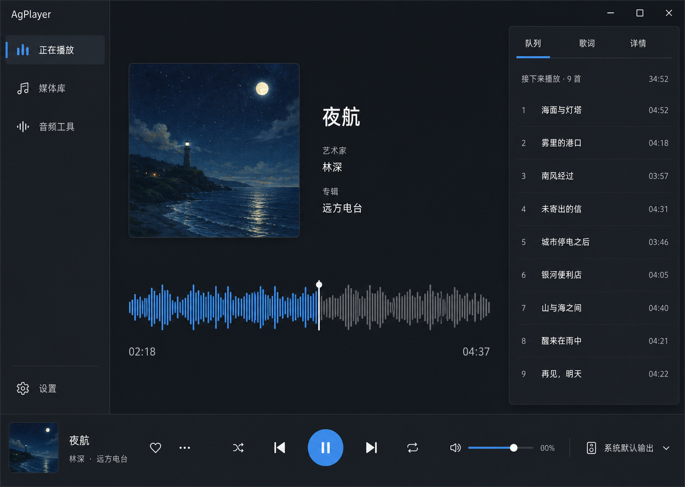
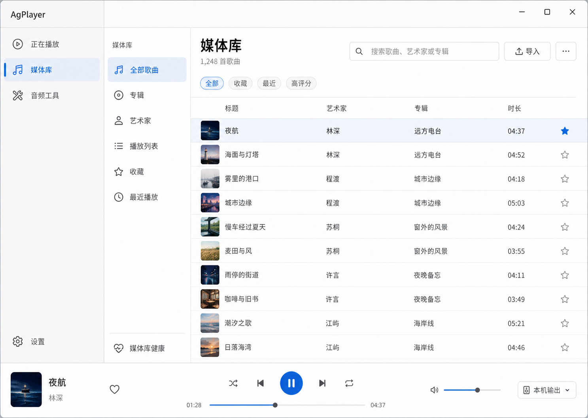
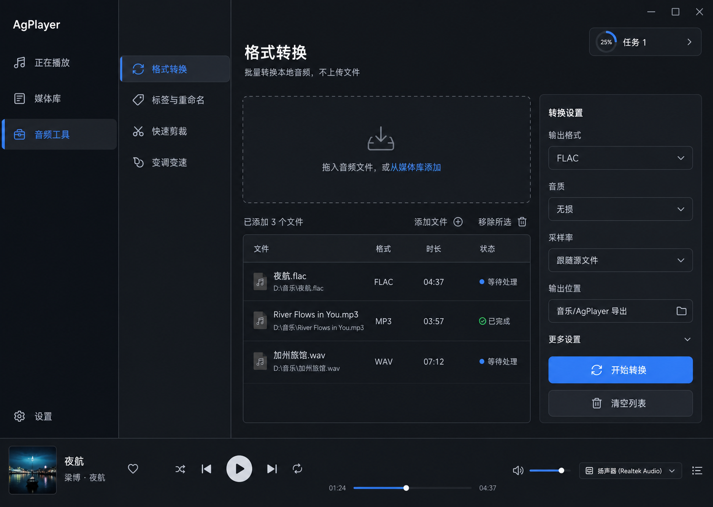
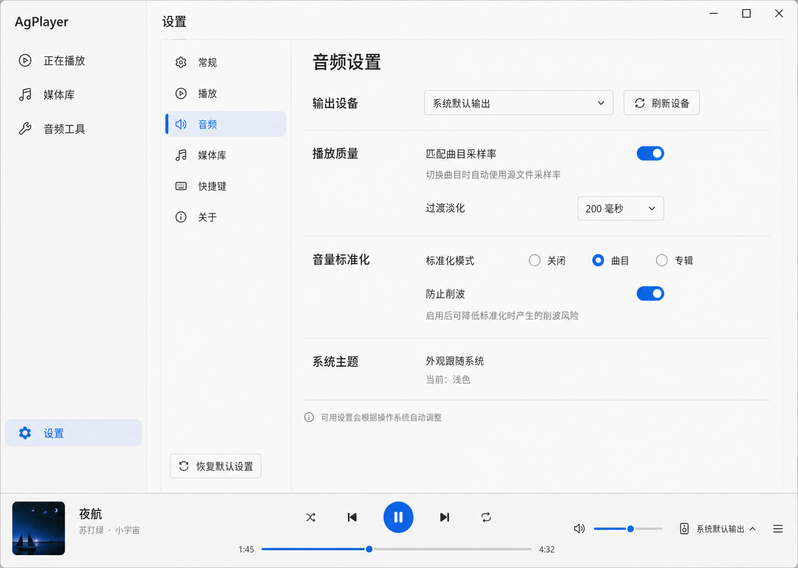

# AgPlayer 跨平台 UI 重设计

日期：2026-08-01

## 产品决定

AgPlayer 定位为“本地离线播放器 + 按需音频工具箱”。它不承担流媒体、社交音乐或 DAW 的职责。设计不继承任何旧 UI，只依据当前真实能力与跨平台桌面交互原则。

## 信息架构

主程序采用一个主窗口和一个可选迷你播放器。主窗口只有三个一级入口：正在播放、媒体库、音频工具；设置固定在导航底部。收藏、最近播放、普通/智能播放列表属于媒体库内部视图，曲库维护属于媒体库的二级入口。

独立列表窗、独立工具窗、磁吸窗口、自绘标题栏不进入新架构。平台原生标题栏、菜单、文件选择器和通知优先。

## 主窗口布局

- 宽度不小于 1180px：216px 展开导航、主内容、320px 上下文栏。
- 840–1179px：64px 紧凑导航、主内容，上下文栏改为抽屉。
- 640–839px：56px 紧凑导航、单列内容，队列、筛选和详情使用覆盖层。
- 最小窗口 640×480；内容区域不产生横向滚动。
- 72–88px 播放坞固定在底部，在所有工作区共享播放状态。

## 页面

### 正在播放

展示封面、曲名/艺术家/专辑、一个承担精确 Seek 的主波形，以及队列/歌词/详情上下文栏。主波形出现时，底部播放坞不再重复进度条。频谱是波形区域的视图切换，不是独立页面。

### 媒体库

使用集合栏加虚拟化曲目表。默认列仅包含标题、艺术家、专辑、时长；格式、采样率、BPM、评分由用户按需显示。搜索、导入、多选批处理属于同一工具栏。缺失、重复、损坏等问题进入“媒体库健康”二级入口。

### 音频工具

一级工具只保留格式转换、标签与重命名、快速剪裁、变调变速。工具在主窗口中打开，并可直接接收媒体库选中项。长任务进入全局任务中心，提供进度、取消、失败原因、重试和打开输出目录。

六轨编辑器降级为 Beta/实验能力，不进入默认工具导航；人声分离不展示，因为当前产品没有对应实现。

### 设置

设置分为常规、播放、音频、媒体库、快捷键、关于。主题自动跟随操作系统，不提供深浅色选择器、玻璃效果、发光效果或波形 RGB 调色器。Windows 专属功能只在真实后端可用时条件显示，不以禁用项污染其他平台。

## 视觉系统

- 系统字体优先，中文回退到 Noto Sans SC。
- 深浅主题使用语义色令牌并跟随系统；选择、焦点和主要操作使用系统强调色。
- 8px 间距体系，8px 常规圆角；优先靠间距、对齐、文字层级和分隔线建立结构。
- 不使用玻璃拟态、霓虹、渐变、RGB 发光、卡片套卡片或装饰性动画。
- 图标使用同一线性图标家族；仅当前主操作可用填充图标。
- 正文 14–16px；时间和数值使用等宽数字。

## 交互与无障碍

- Space 播放/暂停；左右方向键 Seek 5 秒，Shift 组合为 30 秒；Ctrl/Cmd+F 搜索；Ctrl/Cmd+O 导入。
- 表格支持方向键、Enter 播放、Shift 多选和键盘上下文菜单。
- 关键交互目标不小于 44px；功能不得只依赖悬停、右键或颜色。
- 所有控件提供可见焦点、语义名称、状态朗读和明确错误恢复动作。
- 动画 150–250ms，并遵循系统“减少动态”。

## 状态与数据流

主窗口和迷你播放器共享同一播放控制器。媒体库选中项通过统一上下文动作送入播放队列或工具。后台工具任务与主播放状态隔离，并通过全局任务中心发布进度。导航返回时保留表格滚动、筛选和选择状态。

设备丢失、削波、缺失文件和任务失败在相关控件附近显示原因与恢复操作，不使用仅有颜色的提示。破坏性批量操作需要确认，并提供可行时的撤销。

## 范围裁剪

保留：本地播放、曲库、普通歌单、搜索、收藏、波形 Seek、输出设备、ReplayGain、格式转换、标签与文件名编辑。

二级入口：智能歌单、BPM/变调、频谱、迷你播放器、媒体库维护。

Beta：六轨编辑、人声保护、平滑过渡。

删除默认入口：独立列表窗、独立工具窗、磁吸窗口、自绘标题栏、手动主题切换和复杂视觉调色。

禁止宣称：人声/伴奏分离、跨平台已经完成、真实多声卡兼容已经完成。

## 验证要求

- 640、840、1180、1440px 四档窗口布局无横向滚动或裁切。
- 深浅主题、高对比度、减少动态和放大文本分别验证。
- 鼠标、键盘、触控模式和屏幕阅读器焦点顺序通过。
- 50+ 曲目使用虚拟化；10,000 曲目需要真实 QML 60FPS 门禁。
- 每个可见工具完成真实文件导入、处理、取消、失败恢复和输出解码。
- Windows、macOS、Linux 分别完成构建与原生集成验证后，才显示相应平台能力。
- 真实声卡、多声卡、热插拔、蓝牙重连和听感验收仍是发布前人工门禁。
